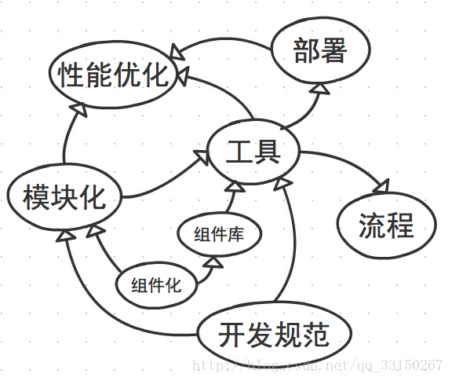
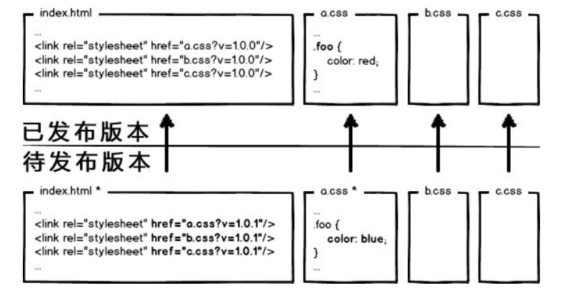

- 《高性能网站建设指南》
- 《高性能网站建设进阶指南》

**前端工程化**

web 应用复杂度的增加，特别是单页面应用的风靡。组件化，工程化，自动化成了前端发展的趋势。或者说一线的互联网公司就是这么做的。

每个前端团队都在打造自己的前端开发体系，这通常是一个东拼西凑，逐渐磨合的过程，在技术发展日新月异的今天，这样的过程真的是不可抽象和复制的么？通过拆解前端开发体系,对前端工程化有所理解。

---

<!-- markdown-to-slides index.md -o index.html -s slide.css -->

## I. 前端工程化

> 前端工程本质上是软件工程的一种。软件工程化关注的是性能、稳定性、可用性、可维护性等方面，注重基本的开发效率、运行效率的同时，思考维护效率。一切以这些为目标的工作都是"前端工程化"。

### 前端工程化面临的问题：

#### （一）开发

- 提高开发生产效率

- 降低维护难度

这两个问题的解决方案有两点：

- 制定开发规范，提高团队协作能力；

- 分治。软件工程中有个很重要的概念叫做模块化开发其中心思想就是分治。

---

#### （二）部署

从部署角度，要解决的问题主要是资源管理，包括：

- 代码审查

- 压缩打包

- 增量更新

- 单元测试

---

### 前端工程化

#### 1.规范化

规范化其实是工程化中很重要的一个部分，项目初期规范制定的好坏会直接影响到后期的开发质量。

- 目录结构的指定

- 开发规范的目的是统一团队成员的编码规范，便于团队协作和代码维护。开发规范没有统一的标准，每个团队可以建立自己的一套规范体系。
  Javascript Airbnb 开发规范 https://github.com/airbnb/javascript

- 前后端接口规范

- 文档规范 readme changelog

- Git 分支管理

- Commit 描述规范

- 定期 CodeReview

---

#### 2.模块化&组件化

组件（component）和模块（module）应该是两个不同的概念。两者的区别主要在颗粒度方面

用通俗的话讲，模块可以理解为零件，比如轮胎上的螺丝钉；而组件则是轮胎，是具备某项完整功能的一个整体。具体到前端领域，一个 button 是一个模块，一个包括多个 button 的 nav 是一个组件。

**模块/组件化开发的必要性**

随着 web 应用规模越来越大，模块/组件化开发的需求就显得越来越迫切。模块/组件化开发的核心思想是分治，主要针对的是开发和维护阶段。

1. Web 应用的组件化开发。http://blog.jobbole.com/56161/

2. 前端组件化开发实践。http://web.jobbole.com/82689/

3. 大规模的前端组件化与模块化。http://www.infoq.com/cn/news/2014/04/front-end-modular

---

#### 3.组件仓库

云物理机部门前端组件工具库：@jd/cloudid_frontend

http://npm.m.jd.com/package/@jd/cloudid_frontend

为什么搭建私有组件库

- 可复用 跨项目可以使用同一套私有组件库
- 方便维护 如需组件调整 只需要修改组件库 不需要跨项目重复修改

添加新组件原则

- 件应先存在于具体项目中，经过重复验证后再抽象、沉淀到本组件库中
- Vue component 只应负责渲染数据和内部逻辑，尽可能不包含 \$t 国际化、ajax 请求等业务数据和逻辑
- 组件和其他模块应尽可能的搭配单元测试、可运行的 storybook 例子
- 应该在 CHANGELOG 中记录每次增删改的组件信息等

---

#### 4.性能优化

由“增量”原则引申出的前端优化技巧几乎成为了性能优化的核心。

> 有加载相关的按需加载、延迟加载、预加载、请求合并等策略；
> 有缓存相关的浏览器缓存利用，缓存更新、缓存共享、非覆盖式发布等方案

| 优化方向 | 优化手段                                                                                         |
| -------- | ------------------------------------------------------------------------------------------------ |
| 请求数量 | 合并脚本和样式表，CSS Sprites，拆分初始化负载，划分主域                                          |
| 请求带宽 | 开启 GZip，精简 JavaScript，移除重复脚本，图像优化                                               |
| 缓存利用 | 使用 CDN，使用外部 JavaScript 和 CSS，添加 Expires 头， 减少 DNS 查找，配置 ETag，使 AjaX 可缓存 |
| 页面结构 | 将样式表放在顶部，将脚本放在底部，尽早刷新文档的输出                                             |

---

#### 5.自动化

- 自动化构建
- 自动化部署
- 自动化测试
- 自动化生成文档

---

## II. 工程化具体方法

### 性能优化

#### 访问量和性能指标

a.css 的请求，如果每次用户访问页面都要加载，很影响性能，很浪费带宽

---

利用 304，让浏览器使用本地缓存。304 叫协商缓存，这玩意还是要和服务器通信一次，我们的优化级别是变态级，所以必须彻底灭掉这个请求，变成这样：

强制浏览器使用本地缓存（cache-control/expires），不要和服务器通信。好了，请求方面的优化已经达到变态级别，那问题来了：你都不让浏览器发资源请求了，这缓存咋更新？

很好，相信有人想到了办法：通过更新页面中引用的资源路径，让浏览器主动放弃缓存，加载新资源。好像这样：

---

---

## III. vue 中引入 sass

---

## VI. 总结

在业界内有这么一句话：任何简单机械的重复劳动都应该让机器去完成。现代前端技术不再是以前刀耕火种的年代了。所以前端工程化的很多脏活累活都应该交给自动化工具来完成。

### 参考资料

1. [前端工程化](https://blog.csdn.net/yin_you_yu/article/details/80462957)
2. [人们常说的前端工程化到底是什么](https://www.jianshu.com/p/0d0f268ec73d)

-- End --

